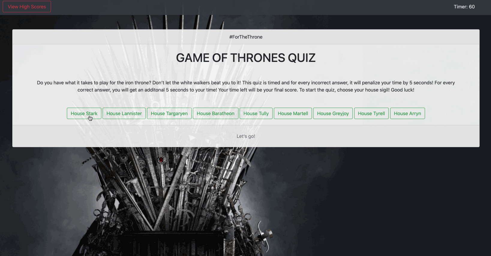

# Impossible Game of Thrones Trivia Quiz

In this project, I’ve created an application that asks a series of trivia questions on the HBO TV series, Game of Thrones (GoT). It is a multiple choice quiz that is responsive and adaptable to multiple screen sizes. This was built for GoT fans and enthusiasts of the TV series and it is a timed quiz to see their knowledge on the show if they are truly fans and compare their scores! 

This was a truly fun and challenging project and given that there were only a couple of days to assemble this quiz and piece them together. I would definitely say that building this application from the ground up and styling it on our own using Bootstrap, HTML and JavaScript, there were tons of frustration and little bits of celebration but I would say, I’m definitely proud to see how much I’ve come to learn from creating this. This wasn’t easy especially for me as a new coder and a complete beginner, I was very much challenged in this one. 

What I do like about this project is that it’s fun to be able to keep improving this quiz by adding more trivia questions, altering the styling to improve the aesthetic and to make the code even better as well. 

I've made an attempt with local storage and almost got it but with the deadline, couldn't finish this part on time as well as displaying it in the high scores modal. I did want to style it more with good images and gifs but again with the amount of time to work on this, it was limited.

## Table of Contents

* [Features](#features)
* [Technologies Used](#technologies-used)
* [GIF of Project](#gif-of-project)
* [Images of Project](#images-of-project)
* [Code Snippet](#code-snippet)
* [Deployed Link](#deployed-link)
* [Authors](#authors)
* [License](#license)
* [Acknowledgments](#acknowledgments)

## Features

This project has a number of features that include the following:

* Main Menu

    This features a start button with the instructions on the quiz as well as a navbar with the view high scores button and a 60 second timer for the quiz. 

* Trivia Portion

    This features the question and the multiple choice buttons and the timer set to begin counting down. With every incorrect answer, the timer is decreased by 5 seconds and with every correct answer, the time increases by 5 seconds. When a button is clicked, the next question will be asked with a different set of multiple choice answers. If the user answers correctly as well, the user will see on the display that they answered correctly or incorrectly.

* End of Quiz Score Input

    If the user is able to finish the quiz before the time ends, their score will be equal to the time left and the input score form will appear where the user can input his/her initials. If the user's time reaches zero, the game will end to the same input score form.

## Technologies Used

* [HTML](https://developer.mozilla.org/en-US/docs/Web/HTML)
* [Bootstrap](https://getbootstrap.com/)
* [Javascript](https://developer.mozilla.org/en-US/docs/Web/JavaScript)

## GIF of Project



## Images of Project

Attached below are screenshots of the start menu page, the trivia portion and the high score page.


## Code Snippet

In this code snippet, I've created an event listener that works for all the multiple choice buttons and displays the text "correct and incorrect" when the user clicks one of the choices as well that it increases the time which is equal to their score or if they click on the wrong answer, it will decrease the time and their final score.

```
// Event listener for all answer buttons
choicesBtns.addEventListener("click", function (event) {

    if (event.target.matches("button")) {

        if (event.target.textContent === triviaQs[i]["correctA"]) {
            correctWrong.textContent = correctIncorrect[0];
            correctWrong.style.color = "green";
            secondsLeft = secondsLeft + 5;
        } else {
            correctWrong.textContent = correctIncorrect[1];
            correctWrong.style.color = "red";
            secondsLeft = secondsLeft - 5;
        };
        questionNumber++;
        if (questionNumber == 10) {
            endQuiz();
        } else {
            triviaQuestions();
        };
    };
});
```


## Deployed Link

* [See Live Site](https://janessaref.github.io/impossible-game-of-thrones-quiz/)


## Authors

* Janessa Reeanne Fong

- [Link to Github](https://github.com/janessaref)
- [Link to LinkedIn](https://www.linkedin.com/in/janessafong)

## License

This project is licensed under the MIT License 

## Acknowledgments

* For the shuffle code, I'd like to acknowledge my tutor Andrew Knapp for teaching me the way it works.
* To my mentors, instructors as well Roger Lee, Kerwin Hy, and Manuel Nunes for helping and teaching me throughout this program
